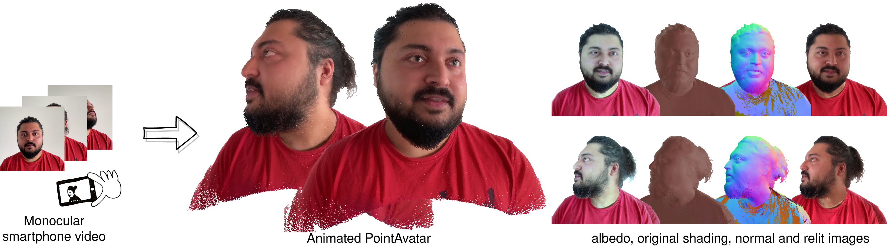

# PointAvatar: Deformable Point-based Head Avatars from Videos 
## [Paper](https://arxiv.org/abs/2212.08377) | [Video Youtube](https://youtu.be/wll_XtgpU7U) | [Project Page](https://zhengyuf.github.io/PointAvatar/)


Official Repository for CVPR 2023 paper [*PointAvatar: Deformable Point-based Head Avatars from Videos*](https://arxiv.org/abs/2212.08377). 
 
## Getting Started
* Clone this repo: `git clone git@github.com:zhengyuf/pointavatar.git`
* Create a conda or python environment and activate. For e.g., `conda create -n point-avatar python=3.9; conda activate point-avatar`.
* Install PyTorch 1.11.0 with conda or pip ([instructions](https://pytorch.org/get-started/previous-versions/)). This version works with both PyTorch3d and functorch.
* We made small modifications to PyTorch3d (0.6.2), so clone our version and install:
```
git clone git@github.com:zhengyuf/pytorch3d.git
cd pytorch3d
git checkout point-avatar
pip install -e .
```
* Install other requirements: `cd ../pointavatar; pip install -r requirement.txt`
* Download [FLAME model](https://flame.is.tue.mpg.de/download.php), choose **FLAME 2020** and unzip it, copy 'generic_model.pkl' into `./code/flame/FLAME2020`
## Preparing dataset
Our data format is the same as [IMavatar](https://github.com/zhengyuf/IMavatar/). You can download a preprocessed dataset from the ETH Zurich server ([subject 1](https://dataset.ait.ethz.ch/downloads/IMavatar_data/data/subject1.zip), [subject 2](https://dataset.ait.ethz.ch/downloads/IMavatar_data/data/subject2.zip) and [subject 3](https://dataset.ait.ethz.ch/downloads/IMavatar_data/data/subject3.zip)). You can run `download_data.bash` to download both datasets and pre-trained models.

If you'd like to generate your own dataset, please follow the instructions in the [IMavatar repo](https://github.com/zhengyuf/IMavatar/tree/main/preprocess).

Link the dataset folder to `./data/datasets`. Link the experiment output folder to `./data/experiments`.

## Pre-trained model
Download a pretrained model from ETH Zurich server ([subject 1](https://dataset.ait.ethz.ch/downloads/IMavatar_data/pointavatar_checkpoint/subject1.zip), [subject 2](https://dataset.ait.ethz.ch/downloads/IMavatar_data/pointavatar_checkpoint/subject2.zip) and [subject 3](https://dataset.ait.ethz.ch/downloads/IMavatar_data/pointavatar_checkpoint/subject3.zip)). See `download_data.bash`.
Uncompress and put into the experiment folder `./data/experiments`.
## Training
```
python scripts/exp_runner.py --conf ./confs/subject1.conf [--is_continue]
```
## Evaluation
Set the *is_eval* flag for evaluation, optionally set *checkpoint* (if not, the latest checkpoint will be used) and *load_path* 
```
python scripts/exp_runner.py --conf ./confs/subject1.conf --is_eval [--checkpoint 60] [--load_path ...]
```
## GPU requirement
We train our models with a single Nvidia 80GB A100 GPU. 
It's also possible to train PointAvatar with less CUDA memory by limiting the number of points. 
For e.g., with a 24GB Quadro RTX 6000, you can set `train.max_points_training` and `point_cloud.max_points` to 240000. 
For evaluation, by default, the latest checkpoint is used. To reduce memory usage, you can use earlier checkpoints by adding `—-checkpoint 60` (or 55).
## Citation
If you find our code or paper useful, please cite as:
```
@inproceedings{Zheng2023pointavatar,
  author    = {Yufeng Zheng and Wang Yifan and Gordon Wetzstein and Michael J. Black and Otmar Hilliges},
  title     = {PointAvatar: Deformable Point-based Head Avatars from Videos},
  booktitle = {Proceedings of the IEEE/CVF Conference on Computer Vision and Pattern Recognition (CVPR)}, 
  year = {2023}
}
```
